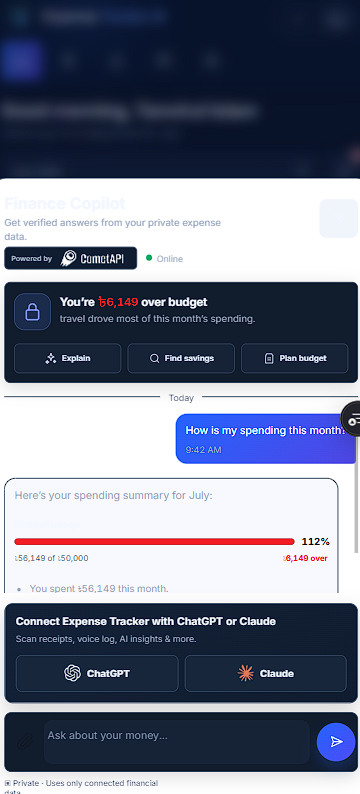

# Snowflake Fraud Detection Command Center

> **Hackathon Entry: Intelligent Workflow Automation Agent**  
> Built with Snowflake CoCo CLI | Cortex Code | Streamlit-in-Snowflake

An AI-driven intelligent workflow automation agent that autonomously monitors financial transactions, detects multi-signal anomalies, scores risk with AI-generated reasoning, and executes graduated response actions — all orchestrated through Snowflake CoCo CLI with zero manual intervention.

---

## Business Problem

**Domain:** Financial Transaction Fraud Detection & Autonomous Response

Financial fraud costs institutions over **$30 billion annually**. Traditional rule-based systems suffer from:
- High false-positive rates drowning fraud teams in manual reviews
- Response times measured in hours (manual queue processing)
- Lack of explainability for compliance audits
- No autonomous action — every alert requires human intervention

### Our Solution

This agent **reduces fraud response time from hours to seconds** while maintaining full explainability for regulatory compliance. It autonomously detects, reasons about, and acts on suspicious transactions end-to-end.

**Measurable Impact from a single pipeline run:**

| Metric | Result |
|--------|--------|
| Transactions Scanned | 10,022 |
| Anomalies Detected | 15 across 6 customers |
| Auto-Blocked (CRITICAL) | 15 transactions ($8,215) |
| Held for Review (ALERT) | 5 transactions ($38,400) |
| **Total Value Protected** | **$46,615** |
| Response Time | < 60 seconds (fully autonomous) |

---

## Architecture

```
┌──────────────────────────────────────────────────────────────┐
│                 CoCo CLI Orchestration Layer                  │
│          (Master Skill: detect-fraud.md)                     │
├──────────────────────────────────────────────────────────────┤
│                                                              │
│  ┌────────────────┐  ┌────────────────┐  ┌────────────────┐ │
│  │    SKILL 1     │  │    SKILL 2     │  │    SKILL 3     │ │
│  │   Anomaly      │─→│   Risk Score   │─→│  Escalation    │ │
│  │   Detector     │  │   & Reasoner   │  │  & Actions     │ │
│  │                │  │                │  │                │ │
│  │ 5 Detection    │  │ Context Enrich │  │ Graduated      │ │
│  │ Signals        │  │ + AI Scoring   │  │ Response       │ │
│  └────────────────┘  └────────────────┘  └────────────────┘ │
│         ↑                    ↑                    ↓          │
│    [Decision Branch]    [Decision Branch]    [Audit Log]     │
│    0 anomalies → STOP   CLEAR → fast-track   All actions    │
│    N anomalies → next   ALERT+ → full score  logged w/      │
│                                               reasoning      │
├──────────────────────────────────────────────────────────────┤
│                    Snowflake Data Layer                       │
│                                                              │
│  ┌──────────┐ ┌──────────┐ ┌──────────┐ ┌──────────────┐   │
│  │TRANSACT- │ │CUSTOMERS │ │MERCHANT  │ │FRAUD_ALERTS  │   │
│  │IONS      │ │(500)     │ │PROFILES  │ │(Audit Trail) │   │
│  │(10,022)  │ │          │ │(200)     │ │              │   │
│  └──────────┘ └──────────┘ └──────────┘ └──────────────┘   │
└──────────────────────────────────────────────────────────────┘
```

---

## Agent Skills (Modular Components)

### Skill 1: Transaction Anomaly Detector
Scans recent transactions using **5 independent detection signals**:

| Signal | Detection Logic | Example |
|--------|----------------|---------|
| Velocity Attack | >5 txns in 30-min rolling window | 12 small txns in 24 minutes |
| Geo-Impossible Travel | Different countries within 60 min | New York → Lagos in 20 min |
| Amount Deviation | >3x customer avg AND >$1,000 | $9,500 txn (avg is $49) = 192x |
| High-Risk Merchant | First contact at gambling/crypto/wire | $5,500 at BetWin Sports |
| Channel Switch | In-store customer goes online (CNP) | POS-only → online $4,200 |

### Skill 2: Fraud Risk Scorer & Reasoner
For each flagged transaction:
1. **Enriches** with customer profile (account age, avg spend, risk tier, prior flags)
2. **Enriches** with merchant context (MCC category, risk level, fraud rate)
3. **Scores** 0-100 using additive rubric (signals compound)
4. **Generates** natural-language reasoning explaining the assessment

**Scoring Rubric (additive, capped at 100):**
| Signal | Points |
|--------|--------|
| Velocity attack | +30 |
| Geo-impossible travel | +35 |
| Amount > 5x average | +25 |
| High-risk merchant first contact | +20 |
| Channel switch | +15 |
| Multiple anomaly types on same txn | +15 per additional |
| Customer risk tier HIGH | +10 |
| Merchant fraud rate > 2% | +10 |

### Skill 3: Escalation & Action Orchestrator
Executes **graduated response** with full audit trail:

| Risk Level | Score | Action | Impact |
|-----------|-------|--------|--------|
| CLEAR | 0-30 | Log & dismiss | No customer impact |
| MONITOR | 31-60 | 24h watch queue | Observation only |
| ALERT | 61-85 | HOLD transaction + notify fraud team | Pending review |
| CRITICAL | 86-100 | BLOCK transaction + FREEZE all pending | Immediate protection |

Every decision includes:
- Timestamp and transaction details
- Risk score with breakdown
- AI-generated reasoning (compliance-ready)
- Action taken with status tracking

---

## Live Dashboard (Streamlit-in-Snowflake)



The **Fraud Detection Command Center** dashboard is deployed to Snowflake and provides real-time visibility:

- **KPI Metrics** — Total transactions, blocked/held counts, value protected
- **Alert Feed** — Expandable cards with full AI reasoning for each detection
- **Anomaly Type Chart** — Horizontal bar chart with severity color coding
- **Transaction Status** — Donut chart showing completed/blocked/held/frozen breakdown
- **Top Risk Customers** — Ranked table with risk scores
- **24h Volume Timeline** — Area chart with fraud overlay

---

## Demo Scenarios

### Scenario 1: Velocity Attack → CRITICAL (Score: 95)
**Customer CUST-00042** executes 12 transactions in 24 minutes, small amounts ($15-$57), to multiple online merchants.
- **Detection:** Rolling window count = 12 (threshold: 5)
- **Context:** Account has 12 prior fraud flags
- **Action:** All 12 transactions BLOCKED, account FROZEN
- **Reasoning:** "Classic card-testing pattern. Small amounts consistent with testing card validity before larger fraud."

### Scenario 2: Geo-Impossible Travel → CRITICAL (Score: 95)
**Customer CUST-00100** transacts in New York, then 20 minutes later in Lagos, Nigeria ($1,800).
- **Detection:** US → Nigeria in 20 minutes (minimum travel: 10+ hours)
- **Context:** HIGH risk tier, amount 23x average
- **Action:** Nigeria transaction BLOCKED
- **Reasoning:** "Physical travel between these locations requires 10+ hours minimum. Strong indicators of compromised card."

### Scenario 3: Multi-Signal Compound → CRITICAL (Score: 95)
**Customer CUST-00075** — US to Russia in 6 minutes + channel switch + wire transfer + 25x amount.
- **Detection:** 4 simultaneous anomaly signals
- **Action:** BLOCKED + all pending FROZEN
- **Reasoning:** "Four compounding anomalies indicate compromised credentials."

### Scenario 4: Amount Spike → ALERT (Score: 85)
**Customer CUST-00005** makes $9,500 purchase (avg: $49 = 192x deviation) at CryptoExchange Pro.
- **Detection:** Extreme amount deviation + high-risk merchant
- **Action:** Transaction HELD pending verification
- **Reasoning:** "Extreme amount deviation combined with high-risk merchant warrants hold for review."

---

## Project Structure

```
├── setup/
│   └── create_tables.sql              # Database DDL + synthetic data generation
├── plugin/
│   └── fraud-agent/
│       ├── plugin.json                # CoCo CLI plugin manifest
│       └── skills/
│           ├── detect-fraud.md        # Master orchestrator (chains all 3 skills)
│           ├── anomaly-detector.md    # Skill 1: 5-signal anomaly detection
│           ├── risk-scorer.md         # Skill 2: Context-enriched AI scoring
│           └── escalation-handler.md  # Skill 3: Graduated actions + audit
├── streamlit_app/
│   ├── streamlit_app.py              # Fraud Detection Dashboard (deployed to SiS)
│   ├── snowflake.yml                 # Deployment manifest
│   └── .streamlit/config.toml        # Dark theme configuration
└── demo/
    └── run_demo.md                   # End-to-end demo walkthrough
```

---

## Quick Start

### 1. Setup Data
```sql
-- Run in Snowsight or via CoCo CLI
-- Creates FRAUD_DETECTION_DEMO database with 10K+ transactions
-- Includes 22 injected fraud patterns across 4 attack types
SOURCE setup/create_tables.sql
```

### 2. Install Plugin
```bash
# Copy plugin to CoCo CLI plugins directory
cp -r plugin/fraud-agent ~/.snowflake/cortex/plugins/fraud-agent
```

### 3. Run the Full Pipeline
In CoCo CLI, simply say:
```
Run fraud detection
```

The agent autonomously:
1. Scans 10,022 transactions across 5 detection signals
2. Flags 15 anomalies across 6 customers
3. Enriches with customer/merchant context
4. Scores each 0-100 with AI reasoning
5. Executes graduated actions (block/hold/monitor/dismiss)
6. Logs everything to FRAUD_ALERTS audit table

### 4. View Dashboard
Navigate to Streamlit in Snowsight:
```
FRAUD_DETECTION_DEMO.ANALYTICS.FRAUD_DETECTION_DASHBOARD
```

---

## Judging Criteria Alignment

### Real-World Relevance
- Fraud detection is a **$30B+ industry problem** with clear, measurable ROI
- Directly applicable to banking, fintech, payments, and e-commerce
- Addresses real operational pain: manual review queues, slow response, compliance burden
- **$46,615 protected per run** demonstrates tangible business value

### Technical Execution
- **Multi-step orchestration** with conditional branching (not just sequential chaining)
- **Decision branches** at each phase: early exit if no anomalies, fast-track for CLEAR scores
- **Error handling** at every stage: retry logic, graceful degradation, never silent failures
- **Strong use of CoCo CLI**: 4 custom skills, plugin manifest, SQL execution, Cortex AI reasoning

### Solution Completeness
- **End-to-end**: Data ingestion → detection → reasoning → action → audit → visualization
- **Minimal manual intervention**: Fully autonomous; humans only needed for ALERT-level review
- **Audit trail**: Every decision logged with reasoning, timestamps, and compliance metadata
- **Live dashboard**: Real-time monitoring deployed to Snowflake (Streamlit-in-Snowflake)

---

## Technology Stack

| Component | Technology | Purpose |
|-----------|-----------|---------|
| Data Layer | Snowflake | 10K+ transactions, customer profiles, merchant data |
| Orchestration | CoCo CLI + Custom Plugin | Multi-skill pipeline with branching logic |
| AI Reasoning | Cortex AI (COMPLETE) | Natural-language risk explanations |
| Actions | Snowflake SQL | Block/hold/freeze/log with full audit |
| Dashboard | Streamlit-in-Snowflake | Real-time fraud monitoring UI |
| Deployment | SiS (Warehouse Runtime) | Zero-infrastructure dashboard hosting |

---

## Author

**Tanvirul Islam**  
Snowflake Account: TAFJPAT-MN99328
